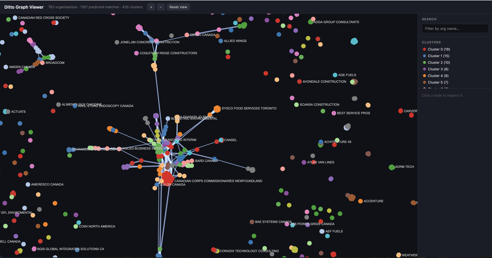

# Graph Visualization Tool for ER

This is an internal tool to look through resolved entities in our data.

## Data

Load `clusters.csv` and `edges.csv` into a new, named subfolder of `viewer/public/data/`. Then add this new name to `index.json`. It will appear as an option in the dropdown.

`clusters.csv` has columns `{name, cluster_id}`. `edges.csv` has columns `{name1, name2, score}`.

## Development

```bash
cd viewer
npm i
npm run dev
```

## Site is available live here:

https://investigativejournalismfoundation.github.io/DittoGraphVisualization/
